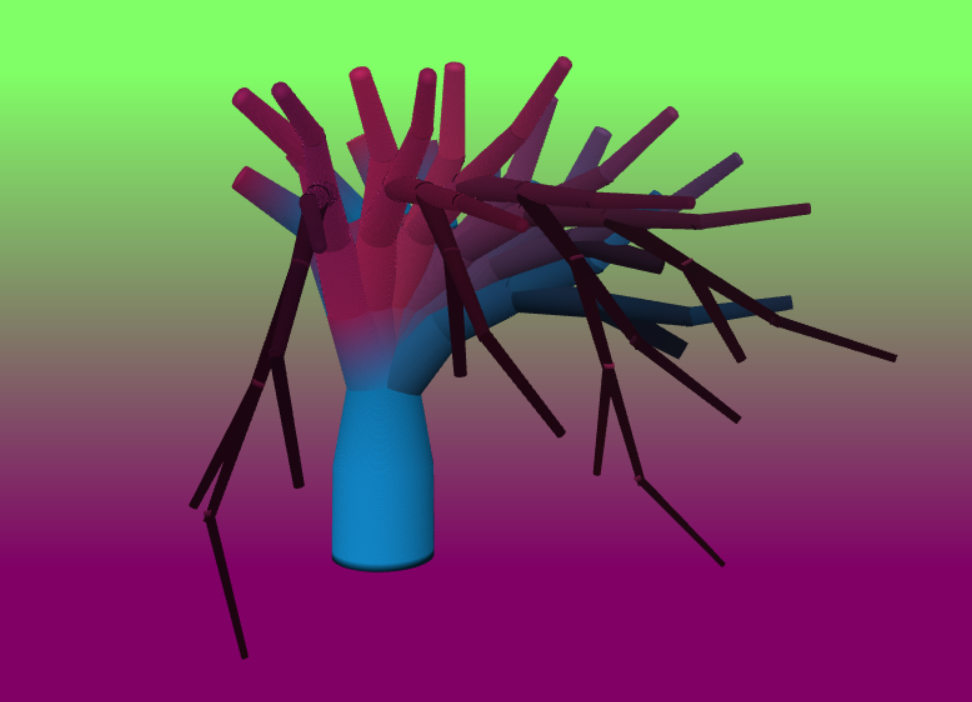

# Alien Hand - Instanced Rendering with L-Systems

By An Duong

Pennkey: onlyname

## Overview
* **Alien Hand**

* **Inspiration**
I wanted to make a tree that looked alien. I drew inspiration from the facehugger from Aliens.

[Live Demo](https://onlyname1.github.io/hw04-l-systems/)

## Implementation
The tree was created using instanced rendering driven by an L-systems implementation. An L-systems grammar was created and ran for eight iterations. The rules of the grammar were randomized to add an organic feel. Afterwards, a "Turtle" followed along the generated L-system. Each time the turtle moved forward a number of instances of a cylinder was created and transformed based on the turtle's orientation, position, and scale. These transformations were sent to the instanced vertex shader to be drawn. The user can change the color of the three colors that the tree interpolates over, as well as the randomness of the branches and their angles.

## Citations
[Reading a local file](https://stackoverflow.com/questions/14446447/how-to-read-a-local-text-file)
